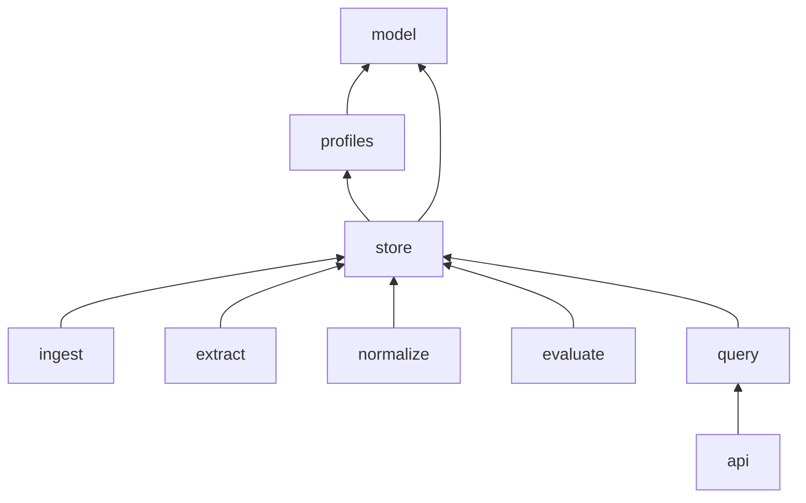

# Architecture

STEM Evidence Dossier is one Python package, `evidence_dossier`, in a src layout. This document sets the module boundaries, the allowed import direction and the contract that the later branches build on. The design source is [the implementation plan](design/implementation-plan.md).

## Subpackages

| Subpackage | Holds | Status |
| --- | --- | --- |
| `model` | Core records, enums, domain attribute classes and ID helpers | Built in the schema and profiles increment |
| `profiles` | `DomainProfile`, `BiologyProfile`, `ComputerScienceProfile`, `GenericProfile` and `get_profile` | Built in the schema and profiles increment |
| `store` | `Store`, `ClaimRejectedError`, `apply_migrations` and the SQL migration files | Built in the schema and profiles increment |
| `ingest` | Literature source adapters and the section parser | Planned for the ingestion branch |
| `extract` | The extractor and relationship validation | Planned for the extraction branch |
| `normalize` | Canonical names and units | Planned for the extraction branch |
| `evaluate` | Gold labels, dataset splits and scoring | Planned for the evaluation branch |
| `query` | Query parser, retrieval, comparability and stance | Planned for the query branch |
| `api` | FastAPI routes | Planned for the query branch |

## Import direction

- `model` imports nothing from the other `evidence_dossier` subpackages. Imports inside `model` are fine.
- `profiles` imports `model`.
- `store` imports `model` and `profiles`.
- Each planned subpackage imports `model`, `profiles` and `store`. It never imports a sibling. The one exception is that `api` imports `query`.

An arrow means "imports". The diagram leaves out the direct imports of `model` and `profiles` from the planned subpackages.

## Contract for the later branches

### Core model

- `evidence_dossier.model` exports every public type. The records are frozen Pydantic models, and they reject unknown fields.
- `EvidenceClaim` is the central record. It holds a `ResearchContext`, an optional `Method`, `Comparator` and `Measurement`, a `Result` and one `EvidenceSpan`.
- A name that normalization touches is a `Term`, with the `original` text and an optional `canonical` value. The claim subject, the method, comparator and measurement names, and units use `Term`.
- `domain_attributes` on `ResearchContext`, `Method` and `Comparator` takes `BiologyAttributes`, `ComputerScienceAttributes` or None. The `profile` tag picks the class (ADR 0003).
- `EvidenceSpan.matches(section)` is True only when the span names the section and `section.text[start_offset:end_offset] == source_text`, with `0 <= start_offset < end_offset <= len(section.text)`.
- `make_work_id(scheme, value)`, `make_document_id(work_id, version)` and `make_section_id(document_id, ordinal)` give the same IDs for the same source identity.

### Profiles

`get_profile(domain)` returns `BiologyProfile` for BIOLOGY, `ComputerScienceProfile` for COMPUTER_SCIENCE and a `GenericProfile` for every other domain. A profile holds plain data: its domain, its attribute model, expected entities, common methods, common measurement types, evidence gap dimensions and comparability features. Normalization rules belong in `normalize`.

### Store

- `Store(path)` opens a file path or ":memory:" and applies every pending migration.
- Each core record has an add method and a get method. A get method returns None for an unknown ID. `get_work_links(work_id)` returns the links where the work is the source or the target.
- An add method raises `sqlite3.IntegrityError` for a duplicate ID or for a missing referenced record.
- `add_claim` raises `ClaimRejectedError` when the study or the span section is missing or belongs to another research work. It also raises it when the span names another research work, or when the span text does not match the section text.
- `list_claims` filters on domain, claim type, research work and study, and it orders the claims by ID.
- An `ExtractionRun` keeps its raw response, its validation status and its errors, for INVALID output too.

### Migrations

The schema lives in `src/evidence_dossier/store/migrations/`. The runner applies each `.sql` file once, in filename order, and records it in `schema_version`. A branch adds the next numbered file, for example `0002_query.sql`, with no code change. A migration file holds no BEGIN or COMMIT, because the runner wraps each file in one transaction. ADR 0002 describes the table layout.

## Vocabulary

- **Research work**: a publication or another research artifact, such as a journal article, a preprint or a technical report.
- **Source document**: one version of the text of a research work that the extractor can read.
- **Section**: a part of a source document. Evidence offsets point into its text.
- **Study**: one coherent evaluation or analysis inside a research work.
- **Evidence claim**: one claim from one study, with its context and its source passage. Query results and counts work at claim level (plan section 9).
- **Evidence span**: the exact passage that an evidence claim comes from.
- **Term**: a name as the source wrote it, next to its canonical form.
- **Domain profile**: plain data that enriches the generic core for one domain.
- **Domain attributes**: the typed fields that a profile adds to a context, a method or a comparator.
- **Work link**: an explicit PREPRINT_OF, VERSION_OF or DUPLICATE_OF relation between two research works.
- **Extraction run**: one extractor call on one source document, with valid or invalid output.
- **Source level**: FULL_TEXT, ABSTRACT_ONLY or METADATA_ONLY. It says how much of a work the extractor could read.
