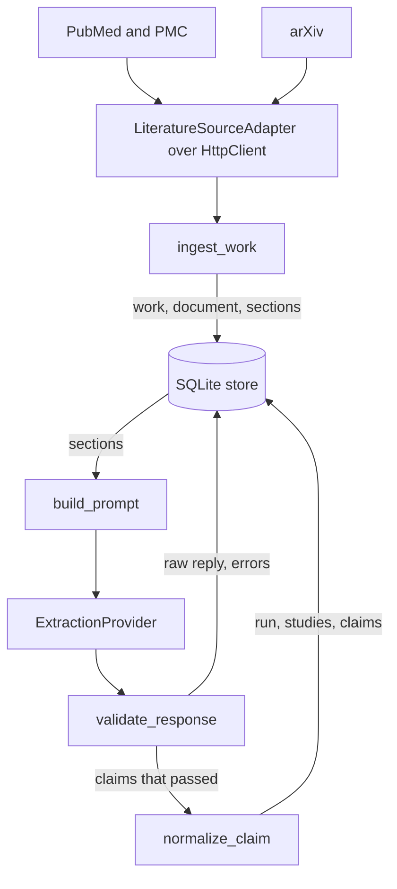
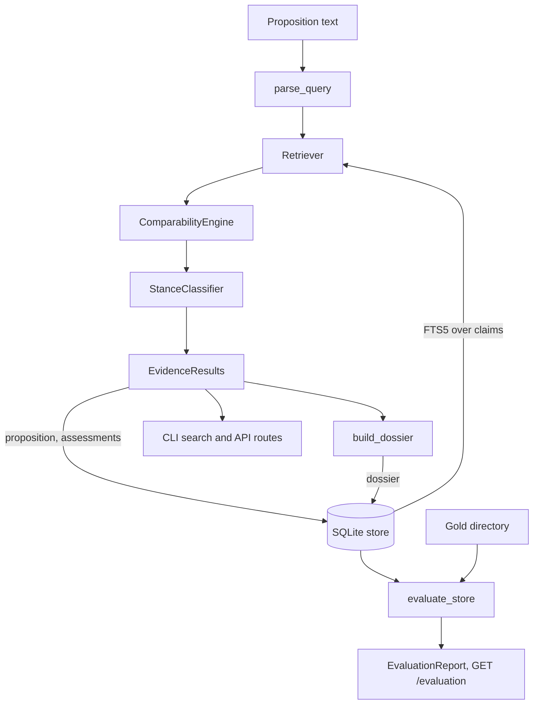
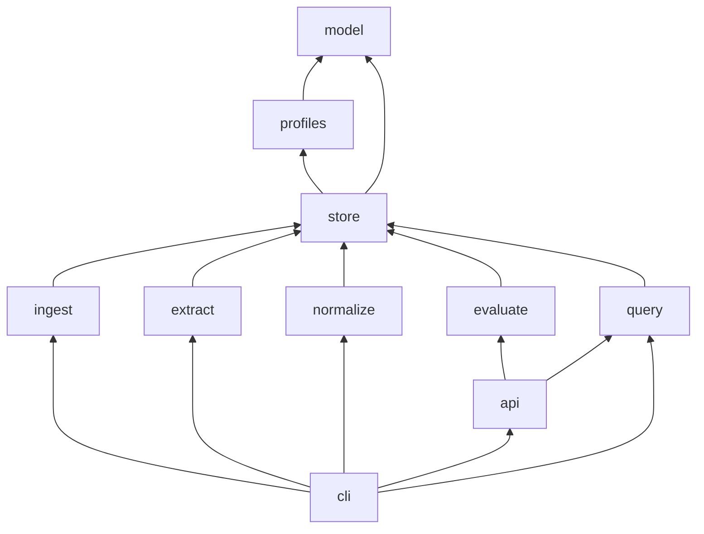

# Architecture

STEM Evidence Dossier is one Python package, `evidence_dossier`, in a src layout. This document sets the data flow, the module boundaries, the allowed import direction and the contract that the later branches build on. The design source is [the implementation plan](design/implementation-plan.md). The class diagrams are in [diagrams.md](diagrams.md).

## System overview

The system runs two paths that share one SQLite file. The build path turns literature into stored claims. The ask path turns a proposition into organized claims. The store is the only place where they meet.

### Build the store

```mermaid
flowchart TB
    pubmed["PubMed and PMC"] --> adapter["LiteratureSourceAdapter over HttpClient"]
    arxiv["arXiv"] --> adapter
    adapter --> ingest["ingest_work"]
    ingest -->|"work, document, sections"| store[("SQLite store")]
    store -->|"sections"| prompt["build_prompt"]
    prompt --> provider["ExtractionProvider"]
    provider --> validate["validate_response"]
    validate -->|"claims that passed"| normalize["normalize_claim"]
    validate -->|"raw reply, errors"| store
    normalize -->|"run, studies, claims"| store
```

1. `ingest_work` fetches the metadata and the best available text through a `LiteratureSourceAdapter`. Text falls back from full text to the abstract and then to metadata only. The pipeline stores the work, one source document with a content hash, and its sections.
2. `extract_document` builds one prompt from the sections and the profile of the work's domain, and sends it through an `ExtractionProvider`. It validates the reply and stores an extraction run. A VALID or PARTIAL run also stores the studies and the claims that passed.
3. `normalize_claim` fills the canonical names and units and keeps every original. `extract_document` receives it as an argument (ADR 0005).

### Ask the store

```mermaid
flowchart TB
    text["Proposition text"] --> parse["parse_query"]
    parse --> retrieve["Retriever"]
    store[("SQLite store")] -->|"FTS5 over claims"| retrieve
    retrieve --> assess["ComparabilityEngine"]
    assess --> classify["StanceClassifier"]
    classify --> results["EvidenceResults"]
    results -->|"proposition, assessments"| store
    results --> dossier["build_dossier"]
    dossier -->|"dossier"| store
    results --> front["CLI search and API routes"]
    store --> evaluate["evaluate_store"]
    gold["Gold directory"] --> evaluate
    evaluate --> report["EvaluationReport, GET /evaluation"]
```

1. `search_evidence` parses the text into a proposition and retrieves candidate claims. It assesses each candidate on seven comparability dimensions with the profile of the claim's domain, classifies the stance with a reason, and groups the items in the plan order. It stores the proposition and every stance assessment.
2. `build_dossier` runs the search and stores a dossier: the corpus scope and the counts by stance.
3. `evaluate_store` scores the stored claims and the search results against a gold directory. It receives the search as an argument (ADR 0008).
4. The command line and the API are the two front ends. The API opens the store once per request.

### Seams

A seam is a place where a stand-in replaces the real component, so tests and the demo run without a network or a model.

| Seam | Interface | Real component | Stand-ins |
| --- | --- | --- | --- |
| Network | `HttpClient.get` | `HttpxClient` inside `PacedHttpClient` | `RecordingHttpClient` and `ReplayHttpClient` for the demo, a recorded client in `tests/` |
| Extraction model | `ExtractionProvider.complete` | `ClaudeCliProvider` | `RecordingProvider` and `RecordedProvider` |
| Normalization | `Normalizer` (ADR 0005) | `normalize_claim` | Any function of the same shape |
| Query parsing | `QueryParser` (ADR 0012) | `parse_query`, which `search_evidence` calls directly | `ModelQueryParser`, which no search or API route constructs |
| Evaluation search | `SearchCallable` (ADR 0008) | The adapter in `api/app.py` around `search_evidence` | Any function of the same shape |

### Trust boundaries

- Paper text is untrusted. The extraction prompt wraps every section between delimiters and tells the model to treat the text as data.
- The model reply is untrusted. `validate_response` accepts one JSON object whose top-level keys and studies match `CandidateClaims` and repeat no study key. It then validates each claim alone and rejects a claim that breaks the schema, whose study key does not resolve, whose evidence section is not in the document, or whose `source_text` does not occur exactly once in its section. The pipeline computes the offsets from the section text and never takes them from the model.
- The store checks the span again. `add_claim` compares the span with the section text and rejects a claim whose study or section belongs to another research work.
- `ClaudeCliProvider` runs the `claude` command line tool with no tools, no settings files, no MCP servers and an empty working directory. The repository holds no key. It asks for the JSON result and raises `ProviderError` when `is_error` is set or the stop reason is not `end_turn`, so a cut reply never reaches validation as a fragment.
- XML from the sources goes through `parse_xml`, which refuses entity declarations.
- PMC full text is stored only under CC BY or CC0 (ADR 0009).
- A query is untrusted input to the optional model parser. The prompt wraps it between delimiters, and a bad reply falls back to the rules.

### Failure paths

- **Ingest.** A PMC article outside open access, or under another license, gives no full text, and the work is stored with its abstract. A full text fetch that raises does the same, and `IngestResult.fetch_error` names the error. An outage never replaces a stored full text with an abstract. The same text ingested twice writes nothing.
- **Extract.** A reply that fails as a whole, or whose every claim fails, becomes an INVALID run with the raw reply and the errors, and no claim is stored. A claim that fails the schema or a relationship check is rejected alone. The run is then PARTIAL: the claims that passed are stored, and each rejected claim keeps an error on the run. A claim ID collision with an earlier extraction rolls back the run, the studies and the claims together.
- **Search.** A relationship verb outside the parser table gives the relationship "unknown", and comparable claims get the stance indirect. A measurement with no polarity in the table also gives indirect (ADR 0007). A claim with low or incompatible comparability gets insufficiently comparable before any stance rule runs.
- **Replay.** A request with no recorded reply raises an error that names the request. A prompt with no recorded reply raises an error that names the prompt key.

### The demo command

`evidence-dossier demo` builds a new store from `demo/corpus.json`. It ingests every listed work, extracts every document, runs every listed query, and prints the ingest lines, one status line per document, the results, and the command that opens the first claim. It refuses to write into an existing `--db`.

| Mode | HTTP client | Provider | Network and key |
| --- | --- | --- | --- |
| Replay (default) | `ReplayHttpClient` over `demo/http` | `RecordedProvider` over `demo/replies` | None |
| `--record --model M` | `RecordingHttpClient` over a paced `HttpxClient` | `RecordingProvider` over `ClaudeCliProvider` | Live, with a logged in `claude` tool |

`--record` writes every HTTP reply into `demo/http`, every model reply into `demo/replies`, and a table of titles, authors and licenses into `demo/SOURCES.md`. It refuses to run when those folders already hold recordings, unless `--only SOURCE:ID` names the corpus entries to record again (for example `--only arxiv:2310.11511`, repeatable). With `--only`, the named entries run live and overwrite their replies, and every other entry replays from the earlier recording. An unknown entry stops the run before any request. A failed model call leaves the old reply in place.

A recorded model reply is keyed by the SHA-256 of its prompt. A change to the prompt, the schema or the section parser makes the recordings stale, and a replay then reports the documents without a recorded reply and names the fix: delete `demo/http` and `demo/replies`, then record again. `--only` helps only while nothing upstream of the prompt has changed since the last full recording.

## Subpackages

| Subpackage | Holds | Status |
| --- | --- | --- |
| `model` | Core records, enums, domain attribute classes and ID helpers | Built in the schema and profiles increment |
| `profiles` | `DomainProfile`, `BiologyProfile`, `ChemistryProfile`, `ComputerScienceProfile`, `PhysicsProfile`, `EngineeringProfile`, `GenericProfile` and `get_profile` | Built in the schema and profiles increment, extended by ADR 0011 |
| `store` | `Store`, `ClaimRejectedError`, `apply_migrations`, the SQL migration files and the FTS5 index | Built in the schema and profiles increment, extended by the query increment |
| `ingest` | Literature source adapters and the section parser | Built in the ingestion increment |
| `extract` | Prompt, providers, validation and the extraction pipeline | Built in the extraction increment |
| `normalize` | Canonical names and units | Built in the extraction increment |
| `evaluate` | Gold labels, dataset splits and scoring | Built in the evaluation increment |
| `query` | Query parser, retrieval, comparability, stance and search | Built in the query increment |
| `api` | FastAPI routes | Built in the query increment |
| `cli` (a module) | The `evidence-dossier` command: ingest, extract, search, claim, serve and demo | Built for the demo path |

## Import direction

- `model` imports nothing from the other `evidence_dossier` subpackages. Imports inside `model` are fine.
- `profiles` imports `model`.
- `store` imports `model` and `profiles`.
- Each other subpackage imports `model`, `profiles` and `store`. It never imports a sibling. The one exception is `api`, which imports `query` and `evaluate`. The `cli` module composes the whole pipeline: it imports `ingest`, `extract`, `normalize`, `query` and `api`, and no subpackage imports `cli`. `extract` takes its normalizer as an argument (ADR 0005), and `evaluate` takes its search as an argument (ADR 0008), so neither imports a sibling.

```mermaid
flowchart BT
    profiles --> model
    store --> model
    store --> profiles
    ingest --> store
    extract --> store
    normalize --> store
    evaluate --> store
    query --> store
    api --> query
    api --> evaluate
    cli --> ingest
    cli --> extract
    cli --> normalize
    cli --> query
    cli --> api
```

An arrow means "imports". The diagram leaves out the direct imports of `model` and `profiles` from the other subpackages.

## Contract between the subpackages

### Core model

- `evidence_dossier.model` exports every public type. The records are frozen Pydantic models, and they reject unknown fields.
- `EvidenceClaim` is the central record. It holds a `ResearchContext`, an optional `Method`, `Comparator` and `Measurement`, a `Result` and one `EvidenceSpan`.
- A name that normalization touches is a `Term`, with the `original` text and an optional `canonical` value. The claim subject, the method, comparator and measurement names, and units use `Term`.
- `domain_attributes` on `ResearchContext`, `Method` and `Comparator` takes `BiologyAttributes`, `ChemistryAttributes`, `ComputerScienceAttributes`, `PhysicsAttributes`, `EngineeringAttributes` or None. The `profile` tag picks the class (ADR 0003).
- `EvidenceSpan.matches(section)` is True only when the span names the section and `section.text[start_offset:end_offset] == source_text`, with `0 <= start_offset < end_offset <= len(section.text)`.
- `make_work_id(scheme, value)`, `make_document_id(work_id, version)` and `make_section_id(document_id, ordinal)` give the same IDs for the same source identity.

### Profiles

`get_profile(domain)` returns `BiologyProfile` for BIOLOGY, `ChemistryProfile` for CHEMISTRY, `ComputerScienceProfile` for COMPUTER_SCIENCE, `PhysicsProfile` for PHYSICS, `EngineeringProfile` for ENGINEERING and a `GenericProfile` for every other domain. A profile holds plain data: its domain, its attribute model, expected entities, common methods, common measurement types, evidence gap dimensions and comparability features. Normalization rules belong in `normalize`. A profile's comparability features reach the engine through `_FEATURE_FIELDS` in `query/comparability.py`, which maps a feature name to the claim field that reports it (ADR 0011).

### Store

- `Store(path)` opens a file path or ":memory:" and applies every pending migration.
- Each core record has an add method and a get method. A get method returns None for an unknown ID. `get_work_links(work_id)` returns the links where the work is the source or the target.
- An add method raises `sqlite3.IntegrityError` for a duplicate ID or for a missing referenced record.
- `add_claim` raises `ClaimRejectedError` when the study or the span section is missing or belongs to another research work. It also raises it when the span names another research work, or when the span text does not match the section text.
- `list_claims` filters on domain, claim type, research work and study, and it orders the claims by ID.
- An `ExtractionRun` keeps its raw response, its validation status and its errors, for PARTIAL and INVALID output too.

### Migrations

The schema lives in `src/evidence_dossier/store/migrations/`. The runner applies each `.sql` file once, in filename order, and records it in `schema_version`. A branch adds the next numbered file, for example `0002_query.sql`, with no code change. A migration file holds no transaction control of its own (no BEGIN TRANSACTION or COMMIT), because the runner wraps each file in one transaction. The BEGIN and END that open and close a trigger body are fine. `0002_query.sql` adds the FTS5 index, the query propositions, the stance assessments and the dossiers. ADR 0002 describes the table layout.

### Ingest

`ingest_work(store, adapter, identifier, *, fetched_at)` fetches metadata and text through a `LiteratureSourceAdapter`, falls back from full text to the abstract to metadata only, and stores the work, the document and its sections. A full text fetch that raises also falls back, and `IngestResult.fetch_error` names the error. That fallback never replaces a stored full text with an abstract. The same text yields no second version. Changed text yields the next version number.

### Extract and normalize

`extract_document(store, document_id, provider, *, normalizer, ...)` builds one prompt from the sections, sends it through an `ExtractionProvider`, validates the response, and stores an `ExtractionRun`. A VALID run stores the studies and the claims. A PARTIAL run stores the studies and the claims that passed, and an error for each claim that failed. An INVALID run stores the raw response and the errors and no claim. A claim ID is its position in the reply, so a rejected claim leaves a gap. Offsets come from the section text, never from the provider. `normalize_claim(claim, profile)` fills canonical values and keeps every original.

### Query

`parse_query(text)` gives a `QueryProposition` with the rules that fired. `Retriever` combines column filters with FTS5 MATCH. `ComparabilityEngine` returns a level and a reason per dimension. `StanceClassifier` returns one of the six stances with a reason. `search_evidence` chains them and groups the results in the plan order. Retrieval and stance stay separate results.

### Evaluate

The scorers take gold records and predicted records and return counts, precision, recall and F1. An empty denominator gives None. `EvaluationReport.to_markdown()` renders one deterministic report.

## Vocabulary

- **Research work**: a publication or another research artifact, such as a journal article, a preprint or a technical report.
- **Source document**: one version of the text of a research work that the extractor can read.
- **Section**: a part of a source document. Evidence offsets point into its text.
- **Study**: one coherent evaluation or analysis inside a research work.
- **Evidence claim**: one claim from one study, with its context and its source passage. Query results and counts work at claim level (plan section 9).
- **Evidence span**: the exact passage that an evidence claim comes from.
- **Term**: a name as the source wrote it, next to its canonical form.
- **Domain profile**: plain data that enriches the generic core for one domain.
- **Domain attributes**: the typed fields that a profile adds to a context, a method or a comparator.
- **Work link**: an explicit PREPRINT_OF, VERSION_OF or DUPLICATE_OF relation between two research works.
- **Extraction run**: one extractor call on one source document, with its validation status: VALID, PARTIAL or INVALID.
- **Source level**: FULL_TEXT, ABSTRACT_ONLY or METADATA_ONLY. It says how much of a work the extractor could read.
