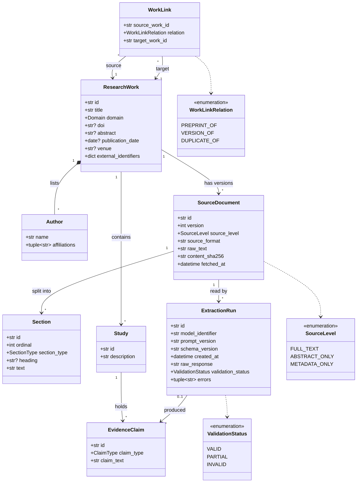
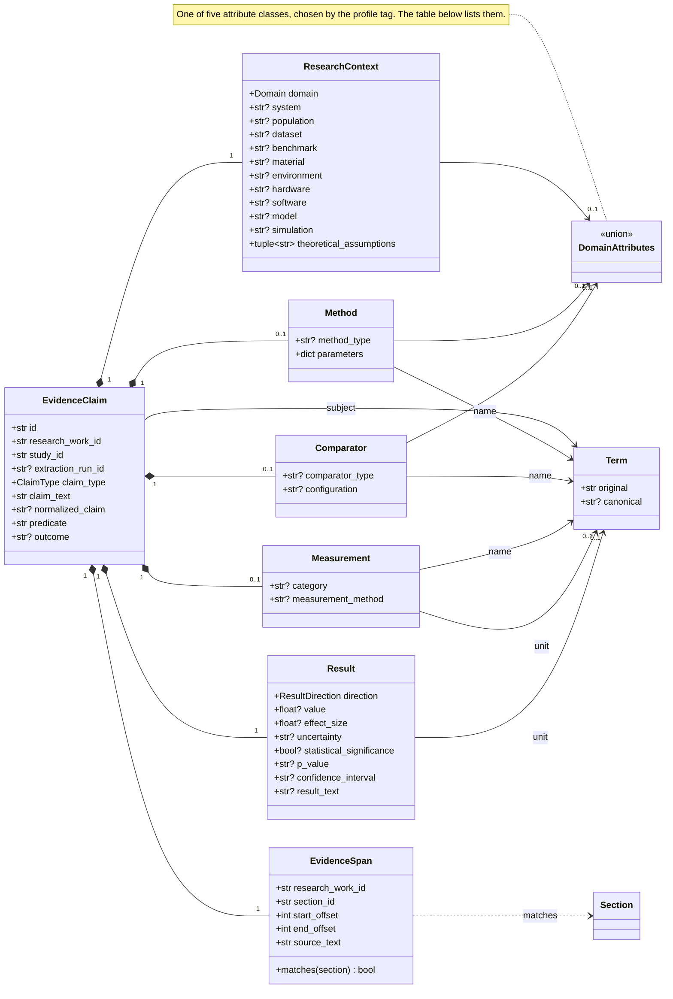
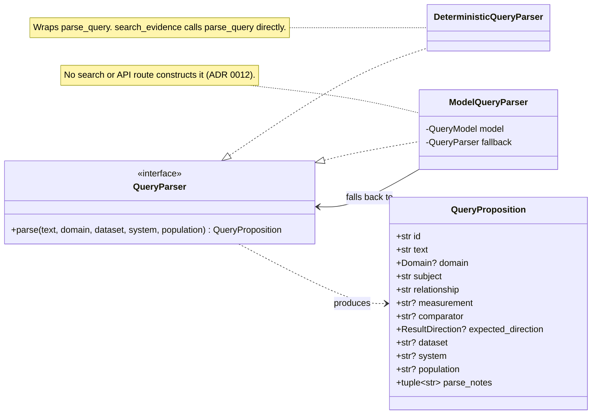
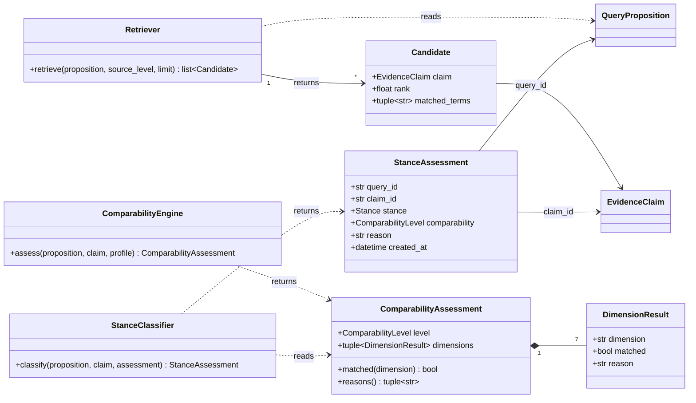
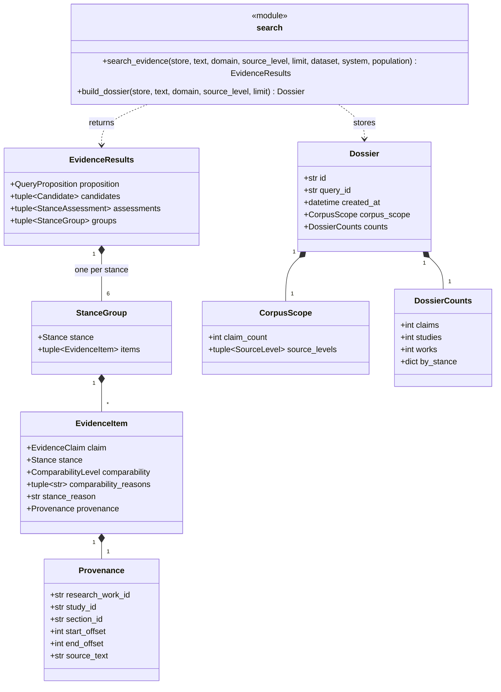
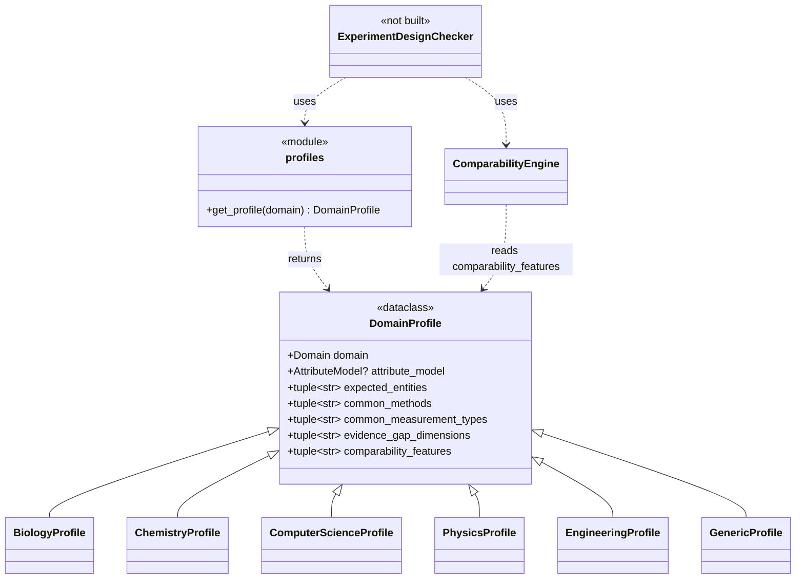

# Diagrams

Class diagrams of the conceptual model (plan section 59). The system diagrams, which show the data flow, are in [architecture.md](architecture.md). A diagram shows the records and services as the code defines them. It does not imply one SQL table per class; ADR 0002 gives the table layout.

Notation: a solid arrow with a label is an association, and a dashed arrow is a dependency. A hollow triangle on a dashed line is interface realization, and a hollow triangle on a solid line is inheritance. A filled diamond marks composition. A multiplicity of `0..1` marks an optional record and `*` a repeated one. A type with a question mark is optional in the code.

## Core research records

- A research work is a container. Claims belong to studies, and studies belong to the work (plan section 9).
- A change to the text of a work is a new `SourceDocument` version, so offsets into an earlier version stay valid.
- A claim and its study belong to the same research work. The store rejects a claim that breaks this rule.
- `extraction_run_id` is optional on a claim, so a claim loaded from a gold file has no run.
- Authors are stored inside the work as JSON, in source order.

## Claim detail

- A `Term` holds the name as the source wrote it next to the canonical form that normalization sets. Normalization keeps every original.
- `matches(section)` is true only when the span names the section and the text at its offsets equals `source_text`, with `0 <= start_offset < end_offset <= len(section.text)`.
- `DomainAttributes` is a discriminated union. The `profile` tag on each attribute class picks the class, and an unknown tag fails validation (ADR 0003). The union is closed, so a new profile adds its class to the model package.
- A claim does not flatten several values into one field. Two models with two scores are two claims (plan section 32).

| Attribute class | `profile` tag | Fields |
| --- | --- | --- |
| `BiologyAttributes` | `biology` | organism, cell_line, tissue, disease_model, intervention, dose, duration, assay |
| `ComputerScienceAttributes` | `computer_science` | task, algorithm, model, model_version, dataset, benchmark, training_data, hardware, baseline, hyperparameters, evaluation_metric, compute_budget |
| `ChemistryAttributes` | `chemistry` | compound, catalyst, solvent, temperature, pressure, concentration, reaction_time, yield, selectivity |
| `PhysicsAttributes` | `physics` | apparatus, sample, temperature, pressure, field_strength, wavelength, instrument, simulation_code, theoretical_assumptions |
| `EngineeringAttributes` | `engineering` | system, component, material, load, operating_conditions, standard, test_method, duty_cycle, tolerance |

## Query and dossier

Three diagrams follow. The first covers parsing, the second the steps from retrieval to a stance assessment, and the third the organized results and the dossier.

- Retrieval and stance stay separate results. `candidates` holds the retrieval order, and `assessments` and `groups` hold the stances.
- `groups` always holds the six stances in the plan order, and a stance with no claim has an empty `items`.
- The comparability engine always returns seven dimension results, one for each generic dimension. The level is EXACT when all seven match. Without a subject match it is INCOMPATIBLE, and without a measurement match it is LOW. Otherwise it is HIGH when the comparator matches and MODERATE when it does not.
- The plan names a `DossierBuilder`. The code implements it as the function `build_dossier`, so the diagram shows the module.
- `DossierCounts` keeps claims, studies and works apart. No field holds a probability.

## Domain profiles

| Profile | Attribute class | Comparability features | Extra evidence gap dimensions |
| --- | --- | --- | --- |
| `BiologyProfile` | `BiologyAttributes` | target, intervention, organism, model, endpoint, dose context | None |
| `ChemistryProfile` | `ChemistryAttributes` | reaction, catalyst, substrate, conditions, measurement | None |
| `ComputerScienceProfile` | `ComputerScienceAttributes` | task, dataset, model family, baseline, metric, hardware, evaluation conditions | unseen datasets, different model families, hardware variation, deployment evidence, longitudinal evaluation |
| `PhysicsProfile` | `PhysicsAttributes` | system, sample, apparatus, conditions, measurement, theoretical assumptions | None |
| `EngineeringProfile` | `EngineeringAttributes` | system, component, material, load, operating conditions, standard, hardware, measurement | None |
| `GenericProfile` | None | The seven generic dimensions | None |

- `get_profile(domain)` returns the profile of the domain, and a `GenericProfile` for MATHEMATICS, MULTIDISCIPLINARY and OTHER_STEM. `GenericProfile` has no attribute class.
- `attribute_model` names one attribute class per profile, as the table lists.
- A profile is plain data. The extraction prompt reads `expected_entities` and `attribute_model`. The comparability engine reads `comparability_features` through the table `_FEATURE_FIELDS` (ADR 0011). `normalize_claim` reads `domain`.
- No code reads `common_methods`, `common_measurement_types` or `evidence_gap_dimensions` yet. The gap dimensions belong to the advanced dossier (plan section 54).
- The Experiment Design Evidence Checker (plan section 55) would consume the same claims and comparison services after the core system is evaluated. Nothing in the repository implements it, and it is not part of the MVP.

## Enumerations

| Enumeration | Values |
| --- | --- |
| `Domain` | BIOLOGY, CHEMISTRY, PHYSICS, COMPUTER_SCIENCE, ENGINEERING, MATHEMATICS, MULTIDISCIPLINARY, OTHER_STEM |
| `SectionType` | ABSTRACT, INTRODUCTION, BACKGROUND, METHODS, EXPERIMENT, RESULTS, EVALUATION, DISCUSSION, CONCLUSION, APPENDIX, FIGURE_CAPTION, TABLE, OTHER |
| `ClaimType` | PERFORMANCE, EFFECT, ASSOCIATION, COMPARISON, EXISTENCE, NON_EXISTENCE, MECHANISM, PROPERTY, SCALING, ROBUSTNESS, REPRODUCTION, THEORETICAL, OTHER |
| `ResultDirection` | INCREASED, DECREASED, IMPROVED, WORSENED, UNCHANGED, MIXED, OBSERVED, NOT_OBSERVED, UNKNOWN |
| `Stance` | SUPPORTS, CONTRADICTS, NULL, MIXED, INDIRECT, INSUFFICIENTLY_COMPARABLE |
| `ComparabilityLevel` | EXACT, HIGH, MODERATE, LOW, INCOMPATIBLE |
